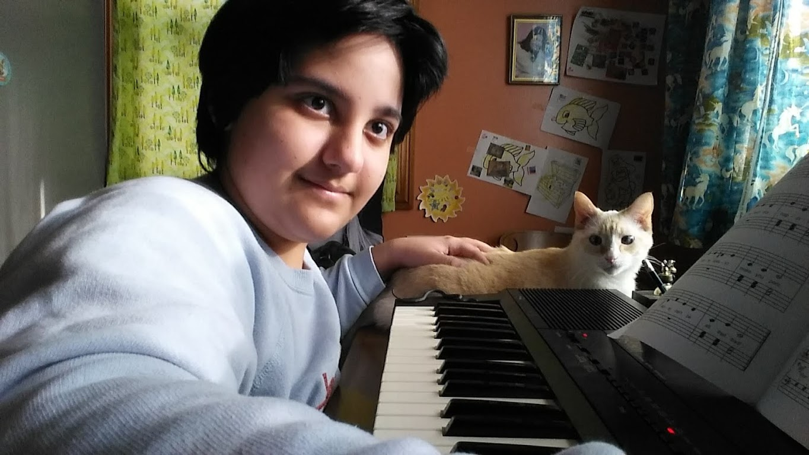

# Oonchie Woodmansee Piano

Piano is a wonderful instrument, and learning it is also wonderful.

## Oonchie Woodmansee

Oonchie found his mother's old electronic keyboard from when she was in elementary school, tried it out and realized he enjoyed playing it. He decided to take lessons and learn to play songs and also sing them. He practices diligently and his skills have progressed over the years. But most importantly, he thinks playing the piano is fun.

## Jeff Klemm

Oonchie's piano teacher is [Jeff Klemm](http://www.jeffklemm.com/lessons "Jeff Klemm's Homepage") and he has been playing piano since age 10.
